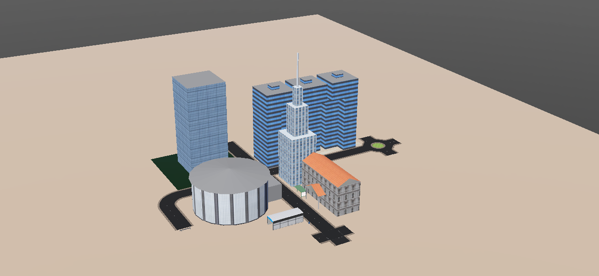

# DEAKIN-ROBOCITY - Webots City Simulation

A virtual city for simulation within Webots, created collaboratively by students enrolled in SIT217 Software Engineering 1: Robotics Project, at Deakin University.

## Table of Contents
* [General Info](#general-info)
* [Technologies](#technologies)
* [Setup](#setup)
* [Contributors](#contributors)

## General Info
This project is created within Webots R2019 using both existing and user-created content. The purpose of this project is to introduce students to collaborative development work using Git.

## Technologies
* Webots R2019a

# Setup
Once you have cloned this project to a local repository, from within Webots select `File->Open World`, navigate to the `worlds` folder of the repo and select `robocity.wbt`.

## Contributors

*  Tim Wilkin
*  John Fernandez
*  Ben Davey
*  Jain Kinshuk
<<<<<<< HEAD

=======
*  Ioannis Doulgerakis
>>>>>>> master
